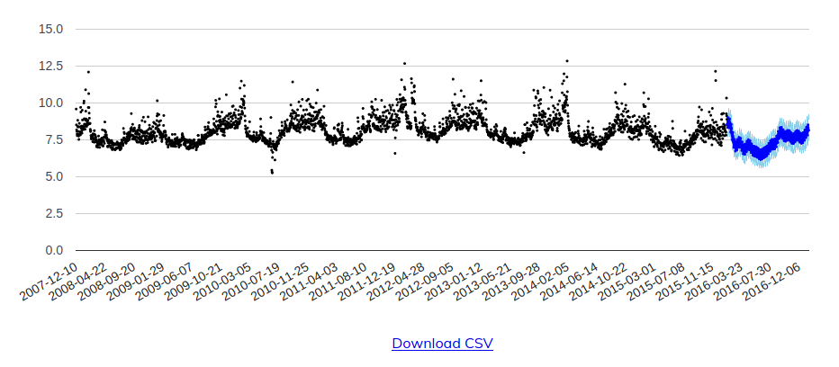
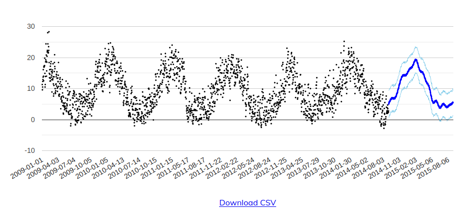

[issue-template]: ../../../issues/new?template=BUG_REPORT.md
[feature-template]: ../../../issues/new?template=FEATURE_REQUEST.md


# Facebook Prophet Forecast

This service uses [Prophet](https://github.com/facebook/prophet) 
and [Statsmodel](https://github.com/statsmodels/statsmodels) to forecast points of a given time series.

It is part of our [Time Series Analysis Services](https://github.com/singnet/time-series-analysis).

### Welcome

The service receives as input 2 datasets named `ds` and `y` (Dates and Data series). 
These inputs can be sent as a CSV (by sending its URL) or directly by filling the `.proto` variables.
Than it uses the Facebook's [Prophet](https://github.com/facebook/prophet) to forecast an X number of points.

### What’s the point?

[Prophet](https://github.com/facebook/prophet) is a procedure for forecasting time series data based on an additive 
model where non-linear trends are fit with yearly, weekly, and daily seasonality, plus holiday effects. 
It works best with time series that have strong seasonal effects and several seasons of historical data. 
Prophet is robust to missing data and shifts in the trend, and typically handles outliers well.


### How does it work?

The user must provide the following inputs:

  - `url`: A CSV file URL (with `ds` and `y` headers).
  - `ds`: the date series if no `url` (`max: 3000`).
  - `y`: the data series if no `url`(`max: 3000`).
  - `period`: the Season-Trend period (`optional`).
  - `points`: Number of points to forecast (`max: 500`).

Note: The length of `ds` and `y` must be the same and greater then 100.

You can use this service from [SingularityNET DApp](http://beta.singularitynet.io/).

You can also call the service from SingularityNET CLI (`snet`).

Assuming that you have an open channel (`id: 0`) to this service:

```
$ snet client call fbprophet-forecast forecast '{"url": "http://bh.singularitynet.io:7000/Resources/example_wp_log_peyton_manning.csv"}'

observed: [ ... ]
trend: [ ... ]
seasonal: [ ... ]
forecast: [ ... ]
forecast_ds: [ ... ]
forecast_lower: [ ... ]
forecast_upper: [ ... ]
```

The output format is data arrays that users can analyse.

### What to expect from this service?

Input:

  - `url`: http://bh.singularitynet.io:7000/Resources/example_wp_log_peyton_manning.csv
  - `points`: 365

Response:

```
observed: [ ... ]
trend: [ ... ]
seasonal: [ ... ]
forecast: [ ... ]
forecast_ds: [ ... ]
forecast_lower: [ ... ]
forecast_upper: [ ... ]
```

Using dApp, user should receive a chart and a link to download the CSV data:



Input:

  - `url`: http://bh.singularitynet.io:7000/Resources/example_albury_min_temps.csv
  - `points`: 365

Response:

```
observed: [ ... ]
trend: [ ... ]
seasonal: [ ... ]
forecast: [ ... ]
forecast_ds: [ ... ]
forecast_lower: [ ... ]
forecast_upper: [ ... ]
```

Using dApp, user should receive a chart and a link to download the CSV data:

